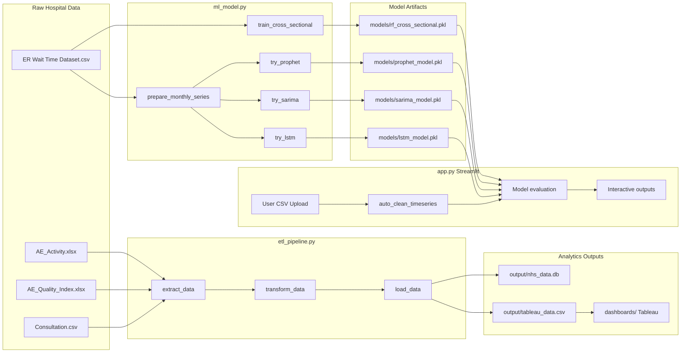

# System Architecture

```mermaid
flowchart LR
    subgraph RawSources ["Raw Hospital Data"]
        AE[AE_Activity.xlsx]
        AQ[AE_Quality_Index.xlsx]
        CS[Consultation.csv]
        ER[ER Wait Time Dataset.csv]
    end

    subgraph ETL ["etl_pipeline.py"]
        direction TB
        EX[extract_data]
        TR[transform_data]
        LD[load_data]
    end

    subgraph Outputs ["Analytics Outputs"]
        DB[output/nhs_data.db]
        TB[output/tableau_data.csv]
        TA[dashboards/ Tableau]
    end

    subgraph Training ["ml_model.py"]
        direction TB
        CSModel[train_cross_sectional]
        TSPrep[prepare_monthly_series]
        Prophet[try_prophet]
        SARIMA[try_sarima]
        LSTM[try_lstm]
    end

    subgraph Models ["Model Artifacts"]
        RF[models/rf_cross_sectional.pkl]
        PR[models/prophet_model.pkl]
        SA[models/sarima_model.pkl]
        LS[models/lstm_model.pkl]
    end

    subgraph App ["app.py Streamlit"]
        direction TB
        Upload[User CSV Upload]
        Clean[auto_clean_timeseries]
        Eval[Model evaluation]
        UI[Interactive outputs]
    end

    AE --> EX
    AQ --> EX
    CS --> EX
    EX --> TR
    TR --> LD
    LD --> DB
    LD --> TB

    TB --> TA

    ER --> CSModel
    ER --> TSPrep
    TSPrep --> Prophet
    TSPrep --> SARIMA
    TSPrep --> LSTM

    CSModel --> RF
    Prophet --> PR
    SARIMA --> SA
    LSTM --> LS

    RF --> Eval
    PR --> Eval
    SA --> Eval
    LS --> Eval

    Upload --> Clean
    Clean --> Eval
    Eval --> UI
```
